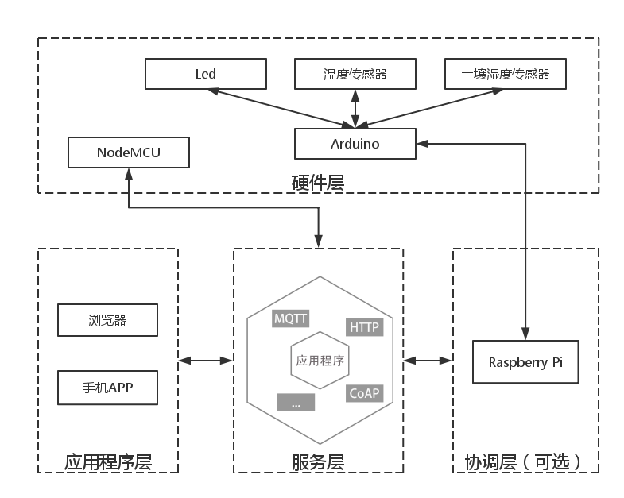

# 前言
下一步，我们要去哪里？

成为程序员并不是一件容易的事，又并不代表你与你隔壁的小王相比，就能多赚很多钱。这个行业有各种有趣的人，有的是科班出身，有的是自学成长 ，有的是培训养成。来自哪里并不重要，重要的是你要去哪里。

也许是金三银四的到来，也许是越来越多的人被优化，也许是春天的到来。它们结合起来，让愈来愈的人开始焦虑起来。尤其是对于那些工作 2~3 年的人来说，这种焦虑愈加的明显。工作 1~2 年的，技术上的问题还有一系列待解决。像我这样工作 4~5 年的人，又有别的焦虑。如最近，我一直忙于构建自己想要的 Tech Lead 的模型、技能——如果有一个东西绕不开，那便是时候学习相关的内容。与此同时，我还开始在编写一个大前端相关的电子书——《大前端的扩张》。

## 前端工程师是什么？

**前端工程师是工程师，后端工程师是工程师，他/她们并没有不同。**

前端工程师是精细分工的一个产物。工程师被分为了前端工程师、后端工程师，对应的团队的 Tech Lead 也有了两个，相应的 KPI 考察也变成了两个团队。尽管出于方便的原因，某些公司向上汇报的渠道往往只有一个：后端工程师。这对于想往管理发展的前端程序员来说，这并不是一件好事。但是对于想往技术发展的前端工程师来说，这一点相当的不错——少去了一系列的会议，还不需要一些“没有意义”的加班。

前端工程师和后端工程师并没有区别，他/她们首先都是人，然后才是工程师，然后才是前/后端工程师。至于这些人，什么时候被机器替换，倒是有一个好问题。后端有 Serverless 这样的大山压在前面，前端有 AI 生成代码的挑战在面前。他/她们有各自的焦虑，后端有自己的无聊，前端有自己的热闹。

**前端没有地位？**

有没有地位，这是一个好问题。可是呢，“你真的在乎这个地位吗？”当我在吐槽“前端没有地位”的时候，我可能有多个意思：

 1. 公司给前端的机会太少了。
 2. 我做的事情带来了更多的价值，应该有更多的收入。
 3. 前端开发的话语权太小了。

那么，你呢？是否也是如此。我们只是在一些利益上做争夺而已——可是呢，当我们投入同样的时间，却没有同样的回报时。我们也应该去争夺一些相关的权益。

可若是呢，要是你的项目里，不懂前端的后端为前端下决策，那就说明：在你的公司里，前端是真没地位，又或者是没有人愿意去争取。原因呢，无非就是一个萝卜一个坑，而那个坑已经被后端占据了。

前端的历史太短，刚刚浴火重新的时候，后端已经把持朝政好几年了。

**前端不重要？**

前端有没有那么重要，是人们心中的想法——大多数程序员（包含我）很难去说服别人，我只会以实际行动去证明。可是，前端真的不重要么？这是一个相当大的误区，既然你需要前端，那说明在这个项目前端是必不可少的。既然必不可少，那它就是重要的。

只是大家口中的前端不重要，并不是说前端不重要。而是前端的某些部分对于他/她而言，不那么重要了：

 - “我不需要复杂的交互，只需要可以工作就好”。
 - “我不需要酷炫的动画，只需要可以串起来就好”。
 - “我不知道校验输入结果，反正后端可以校验就好”。

然后，等你按这个标准实现的时候，会发现他/她们对这个效果非常不满意。总有人会如此，口口声声觉得前端不重要，最后还是需要一个重要的前端角色。不重要，只是压缩支出和时间的一个手段；不重要，只是当前不重要。

我们觉得重要，那就是重要。

**前端工程师是工程师，后端工程师是工程师，他/她们并没有不同。**

一个不学习前端的后端，不能成为一个优秀的工程师。一个不学习后端的前端，也无法成为优秀的工程师。“学习” 包含了两层含义，一个是 GET 学习这个技能，一个是掌握新的技能。

一个不了解后端的前端，和那个你鄙视的后端没有太大的区别。编程语言是一个前端，前后端是一个谋生的端点。**你是一个程序员，你需要持续的学习。**

## 广度与深度

前端是一个门槛越来越低的岗位，那些新人啊，可以快速来到这个行业，COPY/Paste 出类似的代码

广度与深度，并不值得讨论。一个公司中的架构师，绝不只是前端工程师，也绝不只是一个后端工程师。同样的问题，如果有一个人让你只学前端，那个人可能是你领导，或者是大公司想要的那种螺丝钉。下次，遇到这样的问题的时候，不妨站在对方的角度来看这个问题。而如果你只想当一辈子的前端工程师，深入到浏览器底层，那也不是问题。找自己喜欢的那部分就好。

而就个人来说，只有你会了前端，会了后端，你才会开发出一个完整的应用。毕竟优秀的工程师，早晚都是全栈的。如我们之前项目遇到的一个 “URL 编码问题”，它是从前端生成的 URL 开始，要经过浏览器转义（在 Chrome 和 Safari 上有所不同），经过 Vanrish 缓存，再来到 Apache 服务器，还有 Tomcat 服务器，最后还要经历 Spring 框架，才能到达代码层。最后的最后，我们找到了问题是 Firefox 浏览器的预加载，和我们预想的完全不一样。过程中，你需要前端、后端，还需要 DevOps 的相关技能。

扩展你的边境，对你的学习能力会有更大的提升。尤其是，当你觉得前端无聊，或者没有新的东西，请毫不犹豫地拥抱变化。

当然了，如果你只工作不到一年，请先往深度发展。

### 深度：复杂应用的架构

如果只是前端应用来考虑，那大抵是只有少数的应用，可以称得上是复杂应用。这一类型的应用：

 - 可能存在复杂的业务逻辑
 - 可能是因为业务功能数量大，产生了大量的代码
 - 可能是技术实现上困难

这能归类到一级别的前端应用，数量并不多。

### 广度：更大领域的前端技术

从最近几年的趋势来看，还有一个趋势是，客户端融合，导致前端的快速融合，。

当我第一次全面使用 JavaScript + Web 浏览器来开发应用时，我发现它真的非常的快速、省事。

所以，那时在我的第一本书里《自己动手设计物联网》，我完全使用 JavaScript 来开发应用。

 - 前端
 - APP
 - 后端

限于当时的条件，我并没有使用 Node.js 来开发嵌入式应用。而随着更好的 JavaScript 引擎的出现，在嵌入式的机会也越来越大。

## Tech Lead vs Tech Manager vs Tech Expert

技术变得越来越卓越，也意味着我们会承担一些带领她/她人成长的任务，也意味着我们要开始做越来越多的非技术工作，也意味着我们面临这样的抉择。从发展的路线上来看，会有三种不同的角色或岗位需要我们考虑：

**Tech Manager**，岗位。技术管理者是一个真实的岗位，它拥有一些真实的权力，以及对应的 KPI 压力。在一些公司里，它是一个角色的多种职责之一，如它是项目经理（Project Manger），只是集中于技术部分。但是这个岗位，往往不会深入到代码中，只是做技术上的决策——如数据库选哪个，如何去部署等等之类的问题。

**Tech Lead**，角色。技术领导者是一种角色，

**Tech Expert**，underfined。

## 前端领域

### 桌面浏览器

### 移动设备浏览器

### 嵌入式设备浏览器

## 写作的模式

1. 引子 ->

模式 - 你并不需要使用 Node.js 来写这样的功能。除非：

 -  你没有其它语言的开发技能
 - 使用前端技术、JavaScript 开发更快

2. 应用示例

3. 架构规划方案 ->

使用前端技术开发时，应该采用怎样的技术方案？

4. Demo 应用

5. 模式介绍 ->

在编写这样的技术栈时，你可以采用怎样的模式。诸如

Chrome 的发布-订阅者模式

# 前端地位

> 前端困境三步曲之前端地位

最近的，最远的最近，或者说在过去的几个月里，我与几个前端同事，一直在讨论一个话题：『作为一个前端开发人员，我们面临怎样的困境？又该如何去解决？』。

而在较老的一次历史讨论（可能是在 6 小时以前）里，我便想重新理清一次其中的思路，也就有了这篇文章。

## 前端是不是没有地位？

答案：不是，也是。

当我们在技术领域，技术团队，讨论地位的时候，说的实际上是话语权——技术的话语权，KPI 的话语权。技术话语权，是因人而异，当你可被信赖时，你就有了话语权。而 KPI 话语权，实际上指的是 title。

1. **来得晚的前端没有 Title**。Title 是一个很有意思的东西：**先到先得**，你去了一家高速发展的创业公司，你的 title 就升得很快——站在风口，大象都能飞。而，大部分 Web 应用，前期注重的往往都是应用的功能，这也导致了：这些组织在前期并不需要优秀的前端开发。而发展起来之后，便开始追求用户体验、视觉效果、多平台，到了这个时候呢，关键的坑位已经被后端占据了。毕竟好的前端很贵，但是能实现页面的前端到处都是——甚至是后端也是。

2. **后端懂点前端，而前端不懂 CRUD**。事实上，大部分的组织对于团队负责人，都有一个默认的要求：『精通』整个系统——无论是前后端。这就意味着，前端需要懂后端，后端也需要懂前端。所以，一个不懂后端的前端，站不到 title 上；一个不懂前端的后端，站不到 title 上。可是呢，对于普通的开发人员来说，要达到中等前端水平的时间花费，要比后端少得多。而如果放到大前端的领域来考虑，这个问题就需要额外商榷了。

PS：懂后端也并不要求，你精通后端。因为最好的篮球教练，并不要求会打篮球。而打篮球最好的不一定会当技术负责人/Coach，比如——科比被女儿怼：“你不会打篮球，教练是这么教我的” 。当然了，有技术底子是最好的，但是它也可能在一定程度上限制你。

3. **需求导向**（可选）。对于服务型公司，如我司，需求方决定了架构的复杂性，决定了其所需要的 title。而需求方对于架构、复杂度的考量，往往是来自于整个市场的平均知识水平。也就是说，一旦业务方需求不复杂，也就不需要高级的前端开发，便谈不上就不话语权。

综上所述，若是想争取地位需要：去得早，懂后端，机会好。

扯太远了，那么继续往下扯。

## 5 个因素决定前端

### 1. 复杂度，决定前端

同样是做一个手机，诺基亚的功能机，和 iPhone 有不一样的成本。

项目的业务人员/产品经理/产品负责人对于产品的需求，出因此决定了应用/产品的复杂度。诸如于，同样是一个搜索功能，它有不同的实现方式：

1. 普通模式。前端生成搜索的 URL，跳转到对应的搜索结果页。
2. 标签搜索 + 普通搜索。后端返回标签
3. AutoComplete + 普通搜索
4. AutoComplete + 标签搜索 + 普通搜索
5. AutoComplete + 地图搜索 + 标签搜索 + 普通搜索。对了，还要有地图和标签的联动。
6. AutoComplete + 地图搜索 + 标签搜索 + 普通搜索 + 热门搜索。
7. ……

复杂度，决定了对于优秀前端工程师的需求。也因此在某种程度上，决定了前端的话语权。比如说，『出于设计上的需要，决定了后端应该这么做 xxxx』

也因此，诸如于腾讯这样的产品型公司，前后端都没有地垃。

但是，它避免了后端决定了前端需求的要素——这一点非常重要。在产品话语权不高的团队，必然是先到先得的后端管理者，决定了整个产品的走向，也由后端决定了前端的设计。

### 2. 团队规模，决定前端

只有组织内的前端团队达到一定的规模，才能迫使组织的管理者意识到：『我们需要更优秀的前端开发，才能解决当前的瓶颈』。

按 xx 划分：

 - HTML 5 广告页
 - 小型前端应用（微信小程序）
 - 中型前端应用（普通的 Web 应用）
 - 大型前端应用（toB）

按团队规模来划分：

 - 页面级
 - 6 人团队
 - 两个 Pizza 团队级
 - 组织级

所以，如果你只是在切图，如果你只是在画 HTML5

### 3. 流水线式开发

大型组织，需要更明确的分工，以便于机械工的生产更多的应用。

也因此需要更明确的分工，来解决效率的问题。

 - 工具支撑团队
 - 框架开发团队
 - 业务开发团队
 - DevOps 团队

### 4. 客户端多样式

在最近的几年里，前端走向大前端的原因也在于此，对于多种客户端开发的需求：微信小程度、桌面客户端、跨平台应用等等。使得一个个前端开发人员，身为多技。

作者手疼，省去了几十个字。

### 5. 新的领域

嗯，只有新的领域，才存在更多的机会。

1. 边缘计算
2. 区块链
3. 客户端计算
4. ……

作者手疼，省去了几十个字。

### 6. 业务熟悉度

如果你不关心业务，对业务不了解，那么你哪来的自信，去领导整个前后端团队。

作者手疼，省去了几百个字。

## 结论

言而总之，总而言之：只有优秀的前端，才有必要讨论地位。抱怨，解决不了问题——只有起而行动，才能有效地解决问题。

这些也意味着，我们需要更深入的学习。笑~ :)

可是，到底从哪里开始学呢？有没有一本书，能解决这样的问题。

# 大前端

> 大前端是指通过 Web 开发相关的技术（WebView、JavaScript/TypeScript）所能开发、处理的领域。除了包含传统的 Web 前端相比，大前端还包含了——后端（Node.js 如 BFF 层、Serverless）、HTML 5 游戏、物联网、嵌入式应用、移动应用、桌面应用。它的显著特性是：**一次开发，多种平台**。

## 大前端：写给大家看的渐进式前端发展指南

## 为什么是大前端

为什么不是大后端呢？

前端，即面向用户交互，存在一系列的方式。

前端在变窄，

### JavaScript 的神奇魔力

易学、广泛使用、熟悉的语法、

### 无处不在的 WebView

## 什么是大前端？？

> 大前端是指通过 Web 开发相关的技术（WebView、JavaScript/TypeScript）所能开发、处理的领域。除了包含传统的 Web 前端相比，大前端还包含了——后端（Node.js 如 BFF 层、Serverless）、HTML 5 游戏、物联网、嵌入式应用、移动应用、桌面应用。它的显著特性是：**一次开发，多种平台**。

值得注意的是：对于某些领域而言，大前端技术并不是最好的技术，但是它是实现起来最快的技术，也因此特别适合于 **MVP 原型构建**。与此同时，前端技术的动态特性，特别适合于远程更新业务——只需要更新对应的代码，而不需要更新整个应用。

若是就这样领域，在前端里，我们可以分为多个领域。

## 大前端的技术领域

### 前端中的 Web 前端

### 前端中的 GUI

前端是软件 GUI（图形用户界面）的一种形式。从传统的应用厂商，到互联网应用的迁移，我们便可以看到相关的变化。

### 前端中的游戏

### 前端中的物联网（IoT）

### 前端中的移动端

### 前端中的 AR/VR

## 如何成为大前端？

# 大前端：后端

所谓的前端 in 后端，便是**在后端开发中，使用前端相关的语言和技术栈**。最典型的场景，便是使用 Node.js 开发后端服务。虽然 Node.js 已经有了 10 年的历史了，但是以我（Phodal）的角度来看，我更希望的是使用编译型语言，来开发后端服务。动态语言，无法使用编译器来检测错误，难以约束代码变动。

## 你并不需要 JavaScript 开发后端服务

我是一个程序员，然后才是一个前端工程师。使用 JavaScript 来开发后端服务，对于我来说吸引力并不是那么大。

作为一个程序员，我会使用 Java 语言编写后端代码，又或者是开发 Android 应用；因为我博客的缘故，我也会使用 Python 世界里的 Django 来开发后端应用，对于 Flask 也有一定的使用经验。使用 Java 这一点，对于大部分科班出身的程序员来说，它是不可缺少的一项技能。虽然，我并非科班出身，但是在实习的时候，我也有了大量的这门语言的使用经验。

只是呢，并不是所有的时候，我们都有足够的时间来编译运行。所以，我们有了 JavaScript，它的动态语言特性，非常适合于快速开发应用。于是乎，我们便有了

## 服务端渲染

### 模式：模板渲染

在早期，前端开发人员使用的是数据、代码与模板分离的设计，诸如在 Java 里使用 Mustache 来进行服务端渲染。

而随着前端技术的发展，代码和模板往往糅合在一起。

### 模式：异构渲染

## Node.js 打造后端服务

从社区的探索来看，存在一些完全使用 Node.js 开发的后台服务。但是，也存在一系列由于代码不规范造成的问题。从社区的经验来看，Node.js + Express + MongoDB + Angular/Vue/React，便是一些不错的选择。当然了，也有相当多的应用，只是采用了 Node.js 来完成 BFF 层（Backend For Frontends）。在这一层业务上，它只做业务数据的中间处理。

虽然，我经常建议在一些关键的节点上，不要采用 Node.js 来打造后台服务。可一旦涉及到 SPA 的服务端渲染，我们就不得不使用 Express、Koa 等这样的服务端 JavaScript/TypeScript 框架，来解决这样的问题。

### 模式

 - Express
 - Koa
 - Egg.js
 - NestJS
 - Hapi.js
 - Sails.js

### 是否大规模采用？

国内最大规模使用 Node.js 开发后端服务的团队是阿里巴巴：

 - Node 的 Collaborator 有 5 个国人, 其中 4 个在阿里巴巴这边，并且有国内唯一一个 CTC 成员。

所以，对于稍有余力的小型公司来说，除非逼不得请不要大规模采用。

## FaaS & Serverless

> Serverless 架构是指大量依赖第三方服务（也叫做后端即服务，即“BaaS”）或暂存容器中运行的自定义代码（函数即服务，即“FaaS”）的应用程序，函数是无服务器架构中抽象语言运行时的最小单位。在这种架构中，我们并不看重运行一个函数需要多少 CPU 或 RAM 或任何其他资源，而是更看重运行函数所需的时间，我们也只为这些函数的运行时间付费。[^serverless]

[^serverless]: [https://serverless.ink/](https://serverless.ink/)

作为一种折中方案，也是我最喜欢的方案。Serverless 架构是指大量依赖第三方服务（也叫做后端即服务，即“BaaS”）或暂存容器中运行的自定义代码（函数即服务，即“FaaS”）的应用程序，函数是无服务器架构中抽象语言运行时的最小单位。

对于没有后台经验的前端开发人员来说，使用 Node.js 开发后端应用是一种相当大的挑战。大多数非科班的前端程序员，不知道从数据库到 RESTful API 的一系列操作，并且还需要了解到部署等一系列的系统底层知识。因此，使用 Serverless 这种不关心基础设施的技术，可以进一步地降低开发成本。

采用 Serverless 架构，也就意味着，我们提取出了大量的基础设施。而使用 Node.js + JavaScript 作为胶水，来快速连接不同的服务，以形成一个快速有效的方案。并且，编写更少的代码，也意味着更安全、快速。

使用 AWS 来运行大量的 Serverless 计算的成本很高，但是自己搭建一个 Serverless 服务器，来运行自己的 Serverless 应用，则变成了一种更廉价的方式。除了直接基于 AWS 的 Serverless Framework 框架的方案，还有 OpenFaaS、Kubeless、OpenWhisk、Fission 等不同的 Serverless 框架。

## API Gateway & BFF

### API Gateway

### BFF

> BFF，即 Backends For Frontends (服务于前端的后端)，也就是服务器设计 API 时会考虑客户端的使用情况，在服务端根据不同的设备类型，返回不同客户端所需要的结果。BFF 模式，这种模式不会为所有的客户端创建通用的 API。而是创建多个 BFF 服务：一个用于 Web 前端、一个用于移动客户端（甚至一个用于 iOS，另一个用于 Android）等等。[^aofe]

[^aofe]: 前端架构：从入门到微前端

# 大前端：IoT

Web 应用的架构相比于一个物联网系统，无非就是多了一层硬件层以及可选的协调层。

这个硬件层决定了物联网应用比Web应用更加复杂。对于大部分的Web应用来说 ，客户端都是手机、电脑、平板这些设备，都有着强大的处理能力，不需要考虑一些额外的因素。

对于物联网应用来说，我们需要考虑设备上的MCU的处理能力，根据其处理能力和使用环境使用不同的通信协议，如我们在一些设备上需要使用CoAP协议。在一些设备上不具备网络功能，需要考虑借助于可以联网的协助层，并且还需要使用一些短距离的无线传输协议，如低功耗蓝牙、红外、Zigbee等等。

## 传统的物联网

我毕业的时候，选定的毕业论文是一篇关于物联网的论文——《基于 REST 服务的最小物联网系统设计》。它是一篇入门级的论文，但凡是有 CS 基础的人，再加上一些硬件知识，都能写出这样的论文。不过我们的是毕业设计，论文反而有些其次，毕竟能不能过是以实物为主的。因此毕业设计动不动就要烧个几百 RMB，还不算服务器费用。然而，对于我们这些学习硬件为主的专业来说，就不是如此。

这篇论文是之前参加比赛的作品论文的“最小化”，里面使用到的主要就是创建RESTful服务，而它甚至称不上是一种技术。在这个作品里：

 * 我们使用Python语言里的Django框架作为Web服务框架，使用Django REST Framework来创建RESTful服务。
 * 为了使用手机当控制器，我们还要用Java写一个Android应用。
 * 我们使用Raspberry Pi作为硬件端的协调层，用于连接网络，并传输控制信号给硬件。在最初的设计里，因为便宜，我们打算使用运行OpenWRT的路由器来当硬件端的控制器。
 * 我们在硬件端使用Arduino作为控制器，写起代码特别简单，可以让我们关注于业务。
 * 我们还使用了Zigbee模块Xbee及I2C作为连接不同Arduino模块的的介质。
 * 最后，我们还需要在网页上做一个图表来显示实时数据。

所有的这些，我们需要使用Python、Java、JavaScript、C、Arduino五种语言。而如果我们要写相应的iOS应用，我们还需要Objective-C。

而同样的：

我刚实习的时候（2013 年），项目里使用的是 Backbone，作为单页面应用框架的核心来打造 Web 应用。这时，我开始关注于 Node.js，使用它实现物联网应用的可能性。当时，已经有了物联网协议 MQTT 和 CoAP 相关的库，便照猫画虎地写了一个支持 HTTP、CoAP、WebSocket 和 MQTT 的物联网。由于，当时缺乏一些大型应用的开发经典，所以做得并不是很好，但是已经可以看到 JavaScript 在这方面的远景。

一年多后，Ionic 也还没推出正式版，便发现到了这个框架真的很棒——它自带了一系列的 UI 组件，还用 NgCordova 封装了一系列  Cordova 的插件。便开始使用 Ionic 写了一些移动应用，发现还挺顺手的。接着，便拿这个框架尝试写物联网应用，这需要一些原生的插件，如 BLE、MQTT。后来，我也写了一个简单的 CoAP 插件。

后来，我们不再需要编译 Node.js（早期，使用的是 Raspberry Pi 来运行 Node.js），就可以在 ARM 处理器上运行 Node.js。并且我们已经有 Tessel、Espruino、Kinoma Create、Ruff 这些可以直接运行 JavaScript 的开发板。三星还推出 IoT.js，可以让更多的嵌入式设备，直接使用 JavaScript 作为开发语言。

人们开始在硬件上使用 JavaScript 的原因有很多，如 Web 的开发人员是最多的，而 JavaScript 很容易上手。

## 嵌入式设备分类

### 两种前端类型

#### 嵌入式设备作为服务端

诸如 ESP32 或者 ESP8266，它们可以和传统的 Web 应用一样，托管前端应用。

#### 嵌入式设备作为服务端和客户端

如 Android 系统中的

Android Things 相似的还有 Microsoft 10 IoT、Raspberry Pi

### 嵌入式设备分类

 - 低资源受限设备，只能使用传统的编译型语言编写，如 C、C++、汇编，
 - 

#### 低资源受限设备：编译型语言

它们只能使用

#### 普通嵌入式设备：

Android 是用得最多的嵌入式系统，。

OpenWRT 是用得最广泛的嵌入式系统之一，

在某些资源受限的设备上，我们无法运行一个带着完整 JavaScript 引擎的 WebView——出于软件体积、运行内存等因素的限制，去除了这些特性。诸如 CSS 3 中的动画特性，会占用大量的运算资源，算去掉了相应的支持。

## 固件编写

### Johnny-Five

### IoT.js

## Be Professinoal

### Arduino 与 Processing

### ESP866/ESP32 与 Lua

### C 语言

# 大前端：移动端

## 混合应用

依我的角度来看，使用什么跨平台框架来看，区别并不是太大。目前主流的方案，仍然是原生（含跨平台框架） + HTML5 应用。从业务的角度上来看待这个问题，那么还是希望，可以用 HTML 5 的地方多——更新功能方便。

也因此，虽然在过去，笔者写过基于 React Native 的混合应用框架 Dore。我相信：Flutter 也会出现这样的混合应用框架。不过，对于有原生开发能力的团队来说，它们的框架还会是三部分：

 * 原生功能部分
 * 原生 + H5 的频繁更新部分
 * Fultter 的跨平台部分

写业务嘛，框架都只是工具。

## 跨平台应用

### React Native

### Flutter

### Weex

## 小程序

小程序，即 HTML5 小程序，即无需安装即可下载运行的应用程序。与普通的移动 Web 应用不同的是，**小程序相当于是高阶版的混合应用**。

如果只是从这一点上来看，其实是不是和微信一样的定制型小程序，并不是那么重要。重要的，在于与原生**界面结合，并提供离线使用功能。**它也是小程序与普通的 HTML 应用的区别。

# 大前端：桌面应用

## 跨平台 WebView 应用框架

Electron/NW.js

## 跨平台框架

QT + WebView

# 大前端：VR/AR

## VR

## AR

# 大前端：数据可视化

在过去我阅读的一些书籍里面，主要是以 Processing 作为可视化的语言——它起始于 2001 年，它最初是面向美术工作者和设计者创建的，后来变成了全面的设计和原型工具，可以用于创建复杂数据可视化领域。

### 高级篇

### D3.js

# 大前端：游戏

随着移动端的性能不断变好，在 2019 年，我开始看好使用 HTML 5 技术来开发一些游戏。当然了，主要原因还是微信小游戏的出现。但是，不管怎样，我开始尝试在这个领域的探索。

## WebView 游戏

## JavaScript 语言游戏

# 大前端：前端

前端领域，在 2018 年已经趋于平衡，Angular、Vue、React 都没有出现太大的变化。

## Web 应用

### SPA （单页面应用）框架：A/V/R

架构选型上，也趋势于平衡。该用啥的还是用啥，偶尔还是会出现一些框架切换的新闻。尽管在 2019 年，会出现一些新的框架，但是还不太可能快引起变化。

### MPA （多页面应用）框架

## 语言

### TypeScript

TypeScript 真香。

前端，没什么好看——除了，娱乐新闻。

# 大前端：UI & UX

自诩是一个 “斜杠青年” 的我，为自己添加不同的 “title”，设计师/设计学徒便是其中的一个。

一来，作为一个前端开发人员，日常就是要和用户打交道。几年经验下来，多多少少也能积累点经验；二来，除了职业本身，我也是一个喜爱画画的人。只是受限于工作的影响，在这方面的投入便没有那么多。

也因此，这样一来，我们便也是能得到一些慰藉。

## 绘画

## 用户体验设计

## 图形界面设计

# 大前端：命令行接口

## 传统 CLI vs 跨平台 CLI

### 优势？

### 

## 相关实践和原则

Best Practise？

Mopass、ADR、Stepping，多多少少也算是写过一些 CLI。

除了此，使用 Node.js

Clone 代码，执行复制

一般型 Shell，如 ``git clone``

而跨平台，则是 ``fs.copy`` 而非 GNU/Linux 上的 ``cp``，又或者是 Windows 上的 ``xcopy``

相似的工具和语言有 Python 等

### 为什么是 Node.js

因为我们是个前端，相关的环境肯定是有的。只要是个前端开发，一定会有 Node.js 环境。

# 前端，永不止境

## 大前端架构

## 练习

